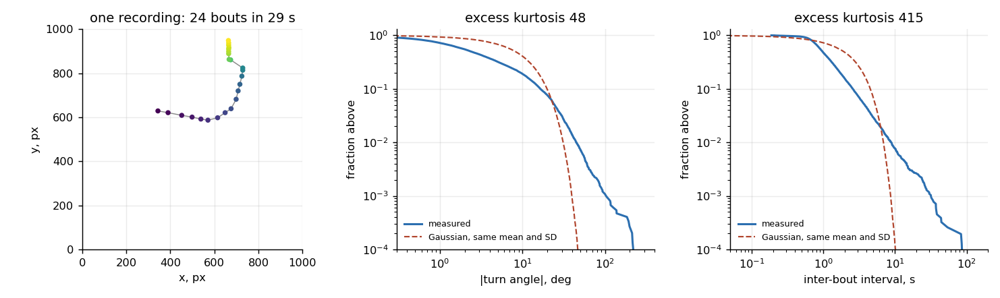
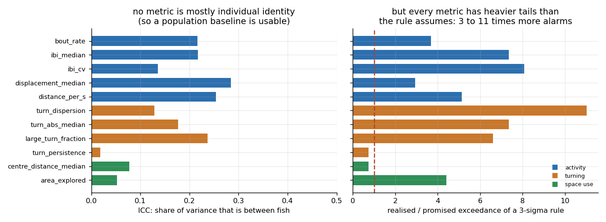
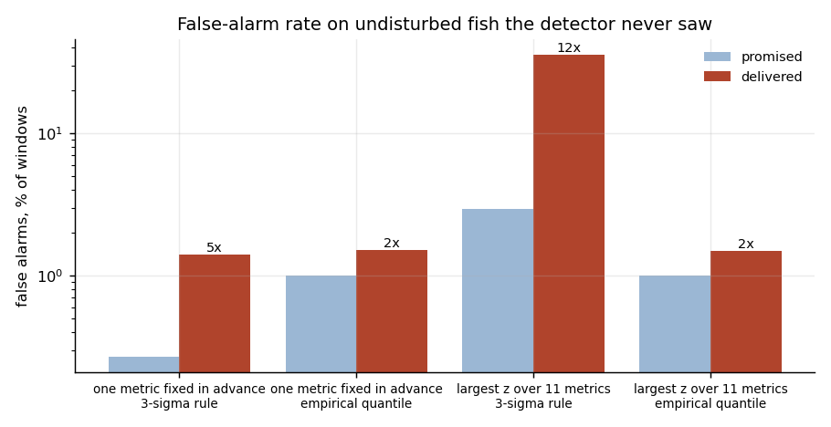
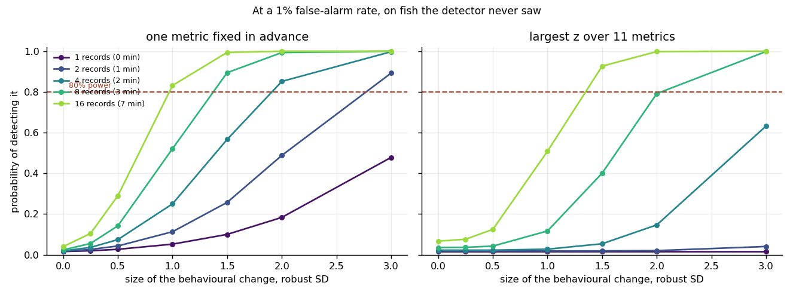

> **Scope, stated first.** The fish in this repository were not stressed. Every
> recording is of undisturbed spontaneous swimming, and that is deliberate:
> this measures the **denominator** — how much an untouched fish varies on its
> own, how often a detector fires when nothing happened, and how large a
> behavioural change has to be before it can be seen at all. Those numbers
> decide whether any later claim about a stressor means anything, and they are
> almost never published.

# What a camera can tell you about a fish, and what it cannot

An aquarium monitored by a camera is an attractive idea: the animals are
continuously visible, tracking is solved, and a behavioural change is supposed
to signal that something has happened to the water, the equipment or the
environment. The literature on it has a ninety-year-old hole in the middle,
identified in the 2018 systematic review of animal-behaviour anomaly reports:
almost no study defines "abnormal behaviour" quantitatively, and none reports
how often that definition would fire on animals that nothing happened to.

This repository fills that hole for one species, one behaviour and one
detector. It is the part of a monitoring system that has to exist before the
interesting question can be asked.

---

## The data

523 recordings of spontaneous swimming from **39 larval zebrafish**, 16 147
bouts in total, published with the zebrafish hidden-Markov-model tutorial of
J. Fernandez de Cossio Diaz and S. Cocco
([SCocco/ZebrafishHMM](https://github.com/SCocco/ZebrafishHMM)). Each bout
carries its time, position, heading, displacement and turn angle.

Larval zebrafish do not swim continuously — they move in discrete bouts, a
tail beat about once a second, and everything here is defined per bout rather
than per frame, which is what makes recordings of different lengths
comparable.

**504 recordings survive the tracking-quality gate** (at least 8 bouts, at
least 5 s, and every position inside the arena); 19 are rejected. 6.4 hours of
behaviour, a median of 26 s and 21 bouts per recording, 11 recordings per
fish.

Eleven metrics, grouped by what they report:

| group | metrics |
|---|---|
| activity | bout rate, median inter-bout interval, its coefficient of variation, median displacement, distance per second |
| turning | turn-angle dispersion, median absolute turn, fraction of large turns, turn-direction persistence |
| space use | median distance from the arena centre (thigmotaxis), area explored |

---

## What came out

| # | Finding | Evidence |
|---|---------|----------|
| 1 | Behaviour is far heavier-tailed than any threshold rule assumes. Excess kurtosis 48 for turn angle and **415** for the inter-bout interval. | §1 |
| 2 | A three-sigma rule on a single behavioural metric fires 3 to 11 times more often than it promises. On the multivariate scan it is **12 times** more often: 36% of windows instead of 3%. | §1, §3 |
| 3 | Individual identity is not the problem it is usually assumed to be: no metric has an intraclass correlation above 0.28, so a population baseline is usable and per-animal calibration is not essential. | §2 |
| 4 | Calibrating the threshold on the data instead of on a Gaussian fixes most of it — 1% promised, 1.5% delivered — and the residual 1.5× is the price of meeting a fish the detector has never seen. | §3 |
| 5 | Fixing one metric in advance roughly doubles the power of the same detector at the same false-alarm rate: 0.83 against 0.51 for a one-SD change over seven minutes. | §4 |
| 6 | Seven minutes of observation are needed to detect a one-standard-deviation behavioural change with 80% probability. A single 26-second recording detects a **three**-SD change less than half the time. | §4 |

---

## 1. What undisturbed behaviour actually looks like

The left panel is one recording: 24 bouts over 29 s, coloured by time. The
other two are the survival curves of the two quantities any monitoring system
computes first, against the Gaussian with the same mean and standard
deviation.

They are not close. Turn angle has an excess kurtosis of 48, and the
inter-bout interval — the "is the fish moving normally?" variable — has an
excess kurtosis of **415**. Intervals five and ten times the mean occur at
rates a normal distribution puts at effectively zero.

This is not a curiosity. A threshold at three standard deviations is chosen
because it corresponds to 0.27% of observations. On these quantities it
corresponds to:

| bout-level quantity | excess kurtosis | 3σ exceedance | times the promise |
|---|---|---|---|
| turn angle | 47.6 | 1.86% | 7× |
| displacement | 3.8 | 1.24% | 5× |
| inter-bout interval | 414.9 | 1.09% | 4× |

At one decision per minute, "one false alarm in 370" and "one false alarm in
54" are the difference between four a day and twenty-seven.

---

## 2. Whose variance is it — the animal's, or the moment's?

If a metric differs mainly between individuals, a population threshold spends
its budget telling fish apart rather than detecting events, and every tank
needs its own baseline. The one-way intraclass correlation splits the variance
directly.

| metric | ICC | 3σ exceedance ratio |
|---|---|---|
| displacement median | 0.28 | 2.9× |
| distance per second | 0.25 | 5.1× |
| large-turn fraction | 0.24 | 6.6× |
| bout rate | 0.22 | 3.7× |
| inter-bout interval median | 0.22 | 7.3× |
| turn dispersion | 0.13 | **11.0×** |
| turn persistence | 0.02 | 0.7× |
| centre distance (thigmotaxis) | 0.08 | 0.7× |

The good news is on the left: **no metric exceeds ICC 0.28**, so 72% or more
of the variance in every one of them is within-animal. A baseline built on a
population transfers to a new individual. Per-fish calibration would buy
something, but it is not the difference between working and not working.

The bad news is on the right, and it is uncorrelated with the good news: the
metrics with the least individual structure are among the worst-behaved in the
tail. Turn dispersion has an ICC of 0.13 and fires eleven times more often
than a three-sigma rule promises. Two of the eleven — turn persistence and
distance from the centre — are close to Gaussian and behave themselves. They
are also the two with the lowest ICC, so on both counts they are the metrics a
threshold should be built on.

---

## 3. A frozen detector, and what it actually does

The detector is deliberately simple enough to pre-register in a paragraph:
centre each metric on the median of the training recordings, scale it by the
median absolute deviation, and threshold. Two versions, differing only in how
many places they look:

- **single** — the robust z of one metric fixed in advance (bout rate)
- **scan** — the largest absolute robust z across all eleven

Training and test fish are disjoint in every one of 200 random splits, so
nothing learned about one animal helps on another. All recordings are of
undisturbed fish, so every alarm is a false alarm.

| statistic | threshold rule | promised | delivered | ratio |
|---|---|---|---|---|
| single | 3σ | 0.27% | 1.42% | 5.3× |
| single | empirical 99th percentile | 1.00% | 1.53% | 1.5× |
| scan | 3σ, Bonferroni for 11 metrics | 2.93% | **35.64%** | 12.2× |
| scan | empirical 99th percentile | 1.00% | 1.50% | 1.5× |

Two things follow.

**The Gaussian rule is not conservative, it is optimistic by an order of
magnitude**, and the multivariate dashboard is worse than the single metric
because the tails compound: taking a maximum over eleven heavy-tailed
variables lands in the tail of the worst one. A system built this way spends a
third of its windows in alarm and is switched off in a week.

**Calibrating on the data fixes most of it.** Setting the threshold at the
99th percentile of the training statistic delivers 1.5% instead of the
promised 1%. The residual 50% overshoot is not a mistake — it is the cost of
generalising to a fish the detector has never seen, and it is the number to
budget for. Anyone reporting a calibrated false-alarm rate measured on the
same animals it was fitted to is understating it by that factor.

---

## 4. How big a change, and how long a look

A known shift is injected into the primary metric of held-out recordings, and
the detection rate measured at the calibrated 1% false-alarm threshold. The
shift is quoted in robust standard deviations of that metric across
undisturbed recordings, which is the only scale on which "a behavioural change
of this size" is meaningful.

Detection probability, single pre-specified metric:

| observation | 0.5 SD | 1 SD | 1.5 SD | 2 SD | 3 SD |
|---|---|---|---|---|---|
| 1 record (26 s) | 0.02 | 0.05 | 0.09 | 0.17 | 0.47 |
| 4 records (2 min) | 0.07 | 0.25 | 0.57 | 0.85 | 1.00 |
| 8 records (3 min) | 0.14 | 0.52 | 0.89 | 0.99 | 1.00 |
| 16 records (7 min) | 0.29 | **0.83** | 0.99 | 1.00 | 1.00 |

And the same for the scan over all eleven metrics:

| observation | 1 SD | 1.5 SD | 2 SD |
|---|---|---|---|
| 8 records (3 min) | 0.12 | 0.40 | 0.79 |
| 16 records (7 min) | 0.51 | 0.93 | 1.00 |

**A single short recording is nearly blind.** Even a three-standard-deviation
change — a fish behaving unlike 99.7% of undisturbed recordings — is caught
less than half the time in 26 seconds.

**Seven minutes buys a one-SD change at 83%.** That is the design number: a
monitoring system that must react to a moderate behavioural change needs
minutes of integration, not seconds, and its alarm latency is set by that, not
by the frame rate.

**Deciding what to look at, in advance, is worth as much as looking twice as
long.** At one SD over seven minutes the pre-specified metric reaches 0.83 and
the scan 0.51. The scan pays for its freedom to find the change anywhere with
a threshold high enough to survive eleven heavy tails. This is the practical
form of the multiple-comparisons rule, and it argues for a single named
primary endpoint fixed before the recording starts.

---

## Verification

Eight checks, all passing:

- the loader returns strictly increasing bout times and the quality gate
  rejects a track placed outside the arena
- circular dispersion is 0 for identical angles and ≈1 for uniform ones
- bout rate, turn persistence and large-turn fraction stay inside their
  physical ranges on all 504 recordings
- **the ICC estimator recovers a known between-group share** (0.2 and 0.6) from
  synthetic data to within 0.1
- **the tail estimator is calibrated**: on 400 000 genuinely Gaussian samples
  the 3σ exceedance ratio comes back at 1.08, so a ratio of 11 on real data is
  a property of the fish and not of the estimator
- the heavy tails are pinned as a test, so a refactor cannot quietly lose them
- the single-metric statistic never exceeds the scan statistic, by construction

---

## What this does not show

- **No stressor.** Nothing was done to these fish. The power curves say what
  size of change is detectable; they do not say that any particular stressor
  produces a change of that size. Pairing the two is the next experiment, and
  it needs a treatment group.
- **Larval zebrafish in a small arena**, filmed in short recordings. Bout
  structure, arena size and recording length all enter the numbers. An adult
  fish in a large tank will have different constants, though the shape of the
  argument — heavy tails, a calibration gap across individuals, minutes of
  integration — is not species-specific.
- **26-second recordings are not continuous monitoring.** Circadian structure,
  feeding, maintenance and seasonal drift are all absent here, and all of them
  widen the baseline further. These false-alarm rates are therefore a *lower*
  bound on what a 24-hour system would see.
- **Injected shifts are stationary and affect one metric.** A real stressor
  moves several metrics at once and usually transiently, which cuts both ways:
  more channels to detect it in, less time in each.
- **Eleven metrics is a choice.** Adding more raises the scan threshold
  further; the single-endpoint result is the argument for not doing that.

---

## Source code

**The source code for this project is not public.** This page documents the
data, the method, the measurements and the conclusions; the implementation is
held in a private repository and is available under NDA.

What is described here: the bout-level loader and tracking-quality gate, the
eleven behavioural metrics, the variance decomposition, the tail
characterisation, the frozen detector and its two threshold rules, and the
injection-based power analysis.

---

## Licence and credit

Documentation and figures: CC BY 4.0. The recordings belong to their authors
and are distributed with the ZebrafishHMM tutorial of J. Fernandez de Cossio
Diaz and S. Cocco; cite them, not this page.
